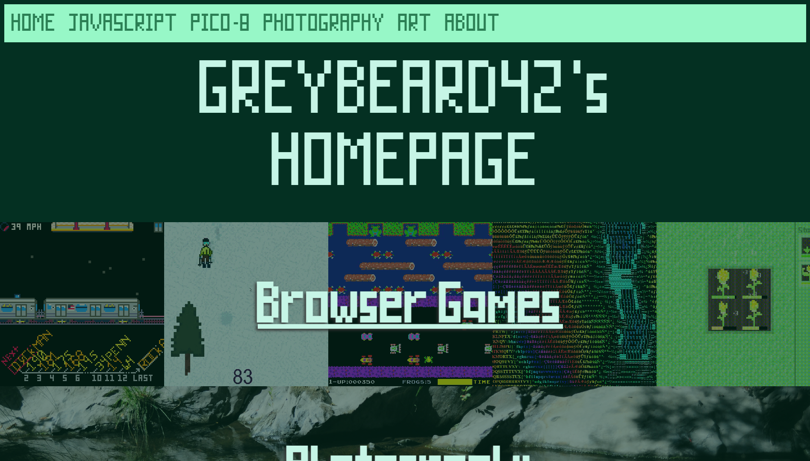

# GreyBeard42's Homepage

My personal Homepage featuring JavaScript Games, Pixel Art, and Photography.

[Check it out!](https://greybeard42.github.io)

My site used to be hosted on [Neocities](https://neocities.org) until I switched to Github Pages :')
Just a bit of history.

All of the assets are made by me using Piskel or Fontstruct.

Enjoy, I suppose.

---

## Colors

If you're curious

-  `#021a12`
-  `#043022`
- 
`#043828`
-  `#9adbc6`
-  `#c6f5e6`
-  `#97f7c7`
-  `#2b7f54`
